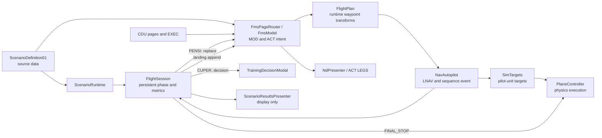

# NAS FMS MVP edge map

Generated: 2026-07-10
Graph source: `graphify-out/graph.json` (1,134 nodes, 2,086 edges, 87 communities)

## Ownership and bindings

| Concern | Owner / binding |
| --- | --- |
| Source scenario and waypoint database | `Assets/ScriptableObjects/ScenarioDefinition01.asset`; never mutated at runtime |
| Scenario handoff | `ScenarioRuntime.Current` |
| Preflight, hold, completion, and metrics | persistent `FlightSession` created before scene load |
| CDU page view tracking | `FmsPageRouter.ShowPage` to `FlightSession.MarkPageViewed` |
| Successful EXEC / route review | `FmsPageRouter.OnRouteActivationComplete` to `FlightSession.NotifyRouteExecuted` |
| Runtime route changes | `FmsPageRouter.ReplaceRuntimeRoute` / `AppendRuntimeRoute`; list clones only |
| Valid waypoint completion | `NavAutopilot.WaypointSequenced` to `FlightSession.NotifyWaypointSequenced` |
| Start gate | `FmsPhaseButtonController` subscribes to `FlightSession.StartAvailabilityChanged`; existing Start button retains its `TakeoffEngageButton` reference |
| Takeoff handoff | `TakeoffProcedureController` at 250 ft then `FlightSession.NotifyNavHandoff` |
| Aircraft stop | `FlightSession` requests `PlaneController.StopAtGround`; the controller owns target/velocity reset |
| Results display | `ScenarioResults` scene and `ScenarioResultsPresenter`; data is read-only |

## Scene and Inspector changes

- `Master_FMS/WorldRoot/.../TakeoffProcedureController`: `liftoffAltFt = 250`, `departureAltFt = 3000`, `navHandoffMinAltitudeFt = 250`.
- Existing Start button remains wired to `FmsPhaseButtonController.ShowTakeoff` and `TakeoffEngageButton.Press`.
- `ScenarioResults` is enabled after `Menu` and `Master_FMS` in Build Settings.
- The legacy disabled `Land_Button` still has an unbound `TakeoffEngageButton`; it remains hidden and is no longer surfaced by `FmsPhaseButtonController`.

## Validation and open risks

- Unity 6000.3.3f1 compiles with no console errors or warnings after reimport.
- Play Mode smoke check passed route review, PENSI replacement, hold exit, touchdown, and final stop.
- `Assets/Tests/PlayMode/TakeoffNavEngagementPlayModeTests.cs` covers the 250 ft handoff target but has not been run through the standalone Unity Test Runner in this session.
- Full real-time route/geometry, map alignment, and Restart Flight visual UX remain manual acceptance checks; existing map scale and source landing geometry were not changed.
